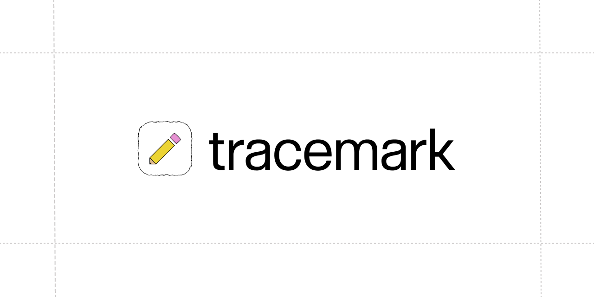

# Tracemark



<br />

A Chrome extension that lets you draw over any webpage and export or copy the result as an image.

**[Install from the Chrome Web Store →](https://chromewebstore.google.com/detail/tracemark/mgckpdklnjeklihpmplgcfnhncifikjd)**

Tracemark injects a full-page drawing overlay into the active tab. Annotate anything — articles, dashboards, designs — with a pencil, text, and framing tools, then export the annotated view as a PNG or copy it straight to your clipboard.

## Features

- **Draw over any page** — pencil, line, frame, text, eraser, and a color picker.
- **Edit as you go** — undo, redo, group, and delete your objects.
- **Capture in one click** — copy to clipboard or export as PNG.
- **Stays out of your way** — draggable toolbar, `1`–`7` tool shortcuts, and Interact / Select modes.
- **Private by design** — runs only on the tab you activate, entirely in your browser.
- **Onboards on install** — a welcome page walks through the tools and shortcuts.

## Controls

Click the toolbar icon to open the overlay on the current tab; click it again to close.

| Tool     | Key | What it does                           |
| -------- | --- | -------------------------------------- |
| Interact | `1` | Scroll and click the page underneath   |
| Select   | `2` | Move, resize, and group what you drew  |
| Pencil   | `3` | Freehand strokes, with size and color  |
| Erase    | `4` | Rub out parts of a stroke              |
| Text     | `5` | Drop a label anywhere on the page      |
| Frame    | `6` | Box off the part that matters          |
| Line     | `7` | Straight lines for pointing things out |

Pencil, Erase, Text, and Frame each open a popover for color, size, and style.

| Shortcut         | Action                   |
| ---------------- | ------------------------ |
| `⌘C` / `Ctrl+C`  | Copy canvas to clipboard |
| `⌘Z` / `Ctrl+Z`  | Undo                     |
| `⌘⇧Z` / `Ctrl+Y` | Redo                     |
| `⌘G` / `Ctrl+G`  | Group selection          |
| `Backspace`      | Delete selection         |

Copy, Export (PNG), and Clear live on the secondary toolbar. Drawings aren't saved — copy or export before closing the overlay or reloading the page.

## Tech Stack

- [WXT](https://wxt.dev) — extension framework and build tooling
- [React 19](https://react.dev) + TypeScript
- [Fabric.js 7](http://fabricjs.com) — canvas engine
- [Tailwind CSS 4](https://tailwindcss.com) + [shadcn/ui](https://ui.shadcn.com)
- [Motion](https://motion.dev) — animations

## Getting Started

Requires [pnpm](https://pnpm.io) (see `packageManager` in `package.json`).

```bash
# install dependencies
pnpm install

# run in dev mode
pnpm dev
```

`pnpm dev` launches a browser with the extension loaded and hot reload enabled.

## Build

```bash
# production build
pnpm build

# package as a distributable zip
pnpm zip
```

Build output lands in `.output/`.

## Scripts

| Script       | Description                                   |
| ------------ | --------------------------------------------- |
| `pnpm dev`   | Dev mode with hot reload                      |
| `pnpm build` | Production build                              |
| `pnpm zip`   | Package the extension as a zip                |
| `pnpm check` | Type-check the project (`wxt prepare && tsc`) |
| `pnpm lint`  | Run ESLint                                    |

## Project Structure

```
src/
├── entrypoints/        # background, overlay, and welcome entrypoints
├── components/         # toolbar, canvas, color picker, popovers, ui
├── context/            # fabric canvas, shadow DOM, toolbar state
│   ├── fabric-canvas/
│   ├── shadow-dom/
│   └── toolbar/        # color, frame, pencil, eraser, text
├── lib/                # helpers + utils
├── App.tsx
└── AppProviders.tsx
```

## How It Works

Clicking the toolbar icon injects an overlay entrypoint into the active tab. The overlay mounts a React app inside a Shadow DOM container, isolating the extension's styles from the host page. A Fabric.js canvas sits on top of the page, and toolbar tools drive canvas state through React context providers. On export, the canvas is serialized to an image for download or clipboard copy.

On first install, the background script opens `welcome.html` — a standalone React page that introduces the tools and shortcuts.

## License

See [LICENSE](./LICENSE).
